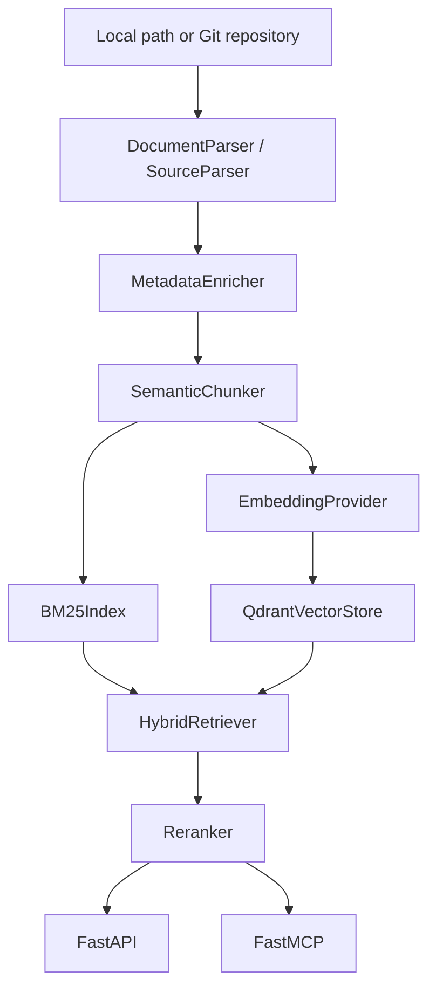

# Architecture

## Core Principles

- Retrieval-focused: the system optimizes for precise, inspectable retrieval rather than generative orchestration.
- Metadata-rich: repo, path, language, framework hints, sections, and symbol data are preserved end to end.
- Deterministic: chunk ids are content-derived, BM25 state is rebuilt deterministically, and reindexing removes stale chunks.
- Local-first: Qdrant, Redis, API, and worker all run through Docker Compose.

## Runtime Components

- `apps/api/main.py`: FastAPI surface for ingestion, query, collections, health, and progress lookup.
- `apps/ingestion/service.py`: repository resolution, deduplication, chunk lifecycle management, and progress tracking.
- `core/parsing/*`: documentation and source parsing with Tree-sitter-aware extraction.
- `core/chunking/semantic.py`: section-aware chunking with overlap and code-block preservation.
- `core/retrieval/*`: BM25, dense retrieval, hybrid merge, and reranking.
- `mcp/server.py`: MCP tools with structured result payloads and source attribution.
