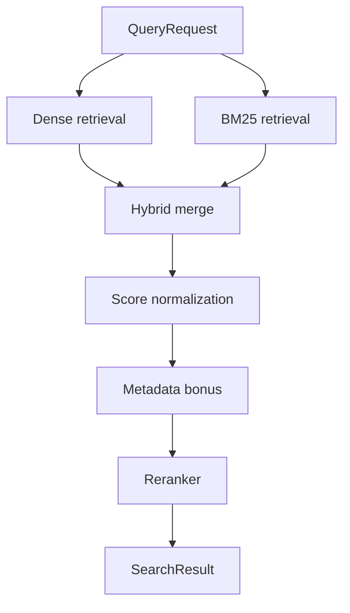

# Retrieval Pipeline

## Retrieval Features

- Natural-language query support
- Repo-aware filtering
- Language-aware filtering
- Section and heading-aware filtering
- Duplicate suppression across dense and keyword candidates
- Confidence scoring via normalized merge scores

## Metadata Lifecycle

- Parsers emit headings, sections, symbols, imports, decorators, comments, routes, and framework hints.
- Chunk payloads carry repo, path, section hierarchy, chunk type, framework type, and ingestion timestamp.
- Qdrant stores the full payload for each chunk.
- BM25 keeps the same chunk payload through `DocumentChunk.payload()`.
- API and MCP both return retrieval metadata directly from indexed payloads.
